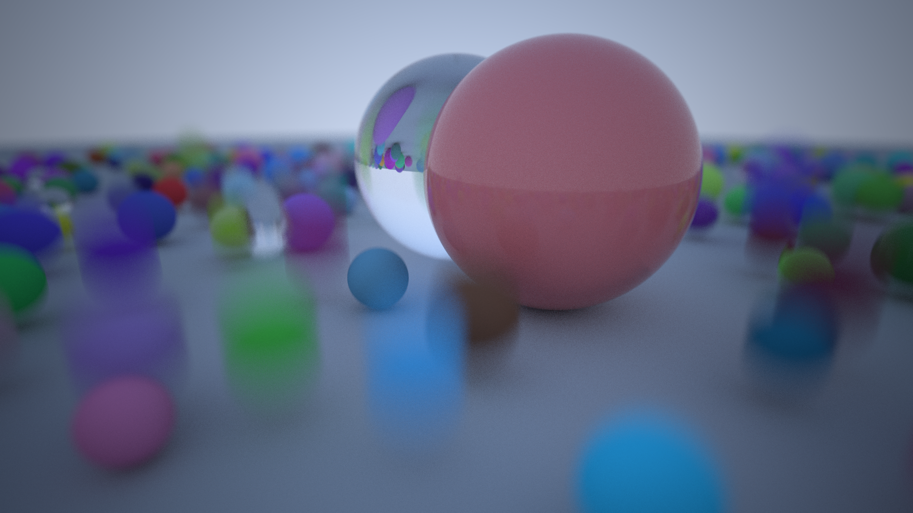
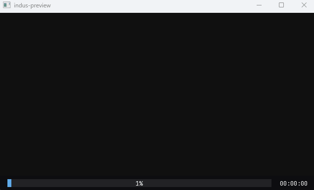
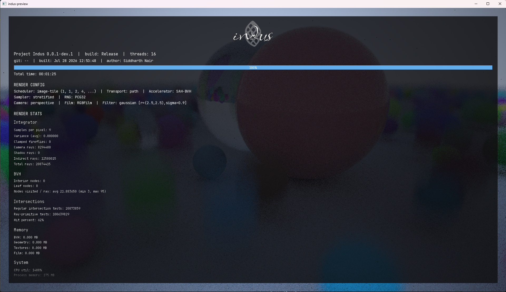

# Indus

Indus is a multithreaded CPU path tracer that I am building from scratch in modern C++.

The project is my implementation-focused study of physically based rendering. I am
mainly interested in building the machinery behind an image—sampling, light transport, BSDFs, cameras, reconstruction filters, acceleration structures, transforms,
multithreaded scheduling, progressive display, and renderer instrumentation—and
understanding how those pieces fit together.

Indus, at its core, is a learning and research project rather than a production renderer. Its design is strongly informed by *Physically Based Rendering* and Peter Shirley's ray tracing books that I've spent time learning over the years, but the codebase is my own attempt to understand and assemble those ideas into a coherent engine.

> [!NOTE]
> The current executable renders a procedurally generated sphere scene inspired by the first complete scene I rendered as part of Peter Shirley's Ray Tracing in One Weekend. The transport core, materials, motion blur, film, BVH, scheduler, and preview pipeline are working; explicit lights, next-event estimation, MIS, textures, meshes, and scene loading are still under development.

## Render gallery

<table>
  <tr>
    <td width="33%" valign="top">
      <a href="docs/images/indus-showcase-motion-blur.png"></a><br>
      <strong>Showcase render</strong><br>
      <sub>1920 &times; 1080, 169 spp. Coated diffuse and dielectric materials, Gaussian reconstruction, depth of field, animated motion blur, transformed primitives, and SAH BVH acceleration.</sub>
    </td>
    <td width="33%" valign="top">
      <a href="docs/images/indus-showcase-progrender.gif"></a><br>
      <strong>Progressive rendering</strong><br>
      <sub>Sample waves of 1, 1, 2, 4, 8, ... update the SFML preview through a frame mailbox while the capture cycles between HUD views.</sub>
    </td>
    <td width="33%" valign="top">
      <a href="docs/images/indus-showcase-hud.png"></a><br>
      <strong>Renderer HUD</strong><br>
      <sub>Configuration and live statistics for the active renderer, including progress, timing, rays, intersections, BVH traversal, and memory use.</sub>
    </td>
  </tr>
</table>

## At a glance

| Area             | Current implementation                                                                               |
| ---------------- | ---------------------------------------------------------------------------------------------------- |
| Transport        | Unidirectional, BSDF-sampled path tracing with Russian roulette                                      |
| Shading          | Lambertian diffuse, ideal dielectric, and GGX coated diffuse                                         |
| Geometry         | Spheres, static/animated transformed primitives, and an SAH BVH                                      |
| Camera and image | Perspective and thin-lens camera, stratified sampling, reconstruction filtering, and sRGB PNG output |
| Runtime          | Custom thread pool, progressive sample waves, frame mailbox, SFML preview, and render statistics     |

## What I've implemented so far

This is a technical overview rather than an API reference. The sections below explain
the decisions that currently determine the engine's rendered output and runtime behavior.

### Light transport and shading

- Iterative Monte Carlo path integration with configurable maximum depth.
- BSDF sampling with the path throughput update
  `beta *= f(wo, wi) * abs(dot(n, wi)) / pdf(wi)`.
- Russian roulette termination once a minimum path depth is reached, with survival-probability compensation to keep the estimator unbiased.
- A BSDF/BxDF split that handles local shading coordinates, evaluation, sampling, PDFs, and lobe classification.
- Lambertian diffuse reflection with cosine-weighted hemisphere sampling.
- Ideal dielectric reflection and transmission selected using the Fresnel dielectric term.
- Coated diffuse reflection combining:
  - a Lambertian base attenuated by interface transmission;
  - a GGX/Trowbridge–Reitz microfacet coat;
  - Smith masking-shadowing;
  - dielectric Fresnel;
  - a matched mixture sampler and mixture PDF for the coat and base components.
- A simple procedural sky gradient used as the current environment radiance source till we implement lights.

The current integrator is a unidirectional path integrator that samples the BSDF only. It does not _yet_ sample lights directly, evaluate emitted radiance from geometry, or use multiple importance sampling.

### Geometry and acceleration

- Generic point, vector, normal, ray, bounds, interval, matrix, quaternion, and
  orthonormal-basis types.
- Forward and inverse affine/projective transforms for points, vectors, normals, rays,
  bounds, and surface interactions.
- Sphere intersection and a primitive abstraction separating geometry, material, and
  object-to-render transforms.
- Static transformed primitives and time-varying animated primitives.
- An axis-aligned bounding-volume hierarchy with three construction strategies:
  - equal primitive counts;
  - centroid midpoint;
  - a 32-bucket surface-area heuristic (SAH, the current default).
- BVH traversal instrumentation, including visited-node distribution, hit rate,
  primitive tests, node counts, and approximate memory use.

### Motion blur

- A shutter interval attached to the camera.
- A time sample generated independently for each camera ray.
- `AnimatedTransform` decomposition into translation, rotation, and scale.
- Linear interpolation of translation and scale, with quaternion SLERP for rotation.
- Intersection of a moving primitive at the ray's sampled shutter time.
- Conservative motion bounds so animated primitives remain valid BVH members.

The present motion-bounds path is deliberately conservative and works best for the
simple linear motion used by the current scene. Tighter bounds for substantial rotation
or non-uniform scaling remain future work.

### Camera, film, and sampling

- Configurable perspective camera with field of view and screen window. I really want to implement the Realistic Camera from PBRT, but there's a lot I'll have to learn till then.
- Thin-lens depth of field using lens-radius and focal-distance controls.
- Camera transforms expressed in world or camera-relative rendering space.
- Independent and jittered stratified samplers backed by cloneable PCG32 generators. I also implemented the LCG algorithm for learning experience.
- Per-pixel sample sequences derived from the pixel, sampling dimension, and seed.
- Box and Gaussian reconstruction filters.
- Importance sampling of the selected reconstruction filter with
  `filterWeight / filterPDF` compensation.
- Linear RGB film accumulation, sensor-to-output color conversion, sRGB encoding, and 8-bit PNG output through `stb_image_write`. Color management and sensor modeling are areas I am continuing to study in greater depth.
- Automatic output names containing aspect ratio, resolution, samples per pixel, render duration, and a short render identifier.

### Parallel and progressive rendering

- A custom `std::jthread`-based worker pool and tiled two-dimensional parallel loop. I first encountered thread pools in another project and implemented a streamlined version here; it remains an area I expect to refine as the renderer grows and my knowledge of concurrency improves.
- One sampler clone per render task so workers do not share mutable sampling state.
- Cancellation propagated through `std::stop_token`.
- Progressive sample waves of `1, 1, 2, 4, 8, ...` samples, capped at 64 samples per wave. Early previews therefore arrive quickly while later waves amortize scheduling and display overhead.
- Rendering on a dedicated thread while the main thread owns the window/event loop.
- Versioned frame snapshots passed through a latest-frame mailbox, keeping renderer progress delivery separate from SFML presentation.
- A final synchronized snapshot and a descriptively named PNG after rendering completes; the filename records resolution, samples per pixel, render time, and a short identifier.

### Preview and instrumentation

- An SFML preview window updated throughout the render.
- Three HUD modes: compact strip, detailed statistics, and hidden.
- `F1` cycles the HUD mode; the mouse wheel scrolls the detailed view.
- Live progress and elapsed time.
- Render-configuration reporting for the scheduler, sampler, RNG, transport integrator, BVH, camera, film, filter, and display sink.
- Post-render statistics for ray counts, intersections, BVH traversal, renderer-owned
  memory, process memory, and CPU utilization.

## How one sample travels through Indus

The high-level path for a pixel sample is:

1. The image-tile integrator asks a cloned sampler for pixel, shutter-time, and lens
   samples.
2. The reconstruction filter maps the pixel sample to a film offset and returns its
   importance weight.
3. The perspective camera generates a time-stamped ray, optionally offset across the
   thin lens and aimed at the focal plane.
4. The scene tests the ray against the BVH. Animated primitives are transformed at that ray's shutter time before their underlying geometry is intersected.
5. At a surface, the material creates a BSDF in the surface's local shading frame.
6. The path integrator samples the BSDF, updates throughput by the BRDF, cosine, and PDF, then spawns the next ray.
7. Russian roulette may terminate sufficiently deep paths; a miss accumulates the
   current environment radiance.
8. The filtered contribution is accumulated into the RGB film. Completed sample waves publish progressively refined snapshots to the display thread.

The engine-level ownership flow is:

```text
IndusConfig
    |
    v
EngineSystemsFactory
    |
    +-- RGBFilm + reconstruction filter
    +-- PerspectiveCamera
    +-- Sampler + PCG32
    +-- PathIntegrator
    +-- SFMLDisplaySink
    |
    v
Procedural scene --> SAH BVH --> render thread --> FrameMailbox --> UI thread
```

## Source layout

Indus uses C++ modules (`.ixx`) throughout most of the renderer.

```text
src/
  core/        Numeric, color, and geometric foundations
  engine/      Public engine facade, configuration, factories, and frame mailbox
  geom/        Shapes, primitives, intersections, transforms, and BVH
  sampling/    Warps, microfacet sampling, and piecewise-constant distributions
  shading/     Materials, BSDF/BxDF interfaces, Fresnel, and concrete lobes
  stats/       Thread-aware render statistics and presentation-ready summaries
  systems/     Camera, film, integrator, RNG, sampler, and scene systems
  ui/          SFML display sink, HUD, components, and branding
  utilities/   Thread pool, parallel loops, jobs, and timing
  main.cpp     Current render configuration and executable entry point
```

The public entry point is the `indus.engine` module. `main.cpp` fills an `IndusConfig`,
constructs `Indus`, and runs a one-shot render.

## Building and running

### Current requirements

- Windows x64.
- Visual Studio/MSVC with C++ modules and `std:c++latest` support. The solution currently
  targets the MSVC `v145` toolset.
- SFML 2.6.1 headers and import libraries.
- `stb_image_write.h`.
- The fonts used by the SFML HUD.

The current Visual Studio project expects local dependencies in this layout:

```text
dep/
  stb_image_write.h
  SFML/
    Graphics.hpp
    ...
    lib/
  fonts/
    JetBrainsMono-Regular.ttf
    JetBrainsMono-Bold.ttf
    indus-logo.otf
```

`dep/` is currently excluded from version control, so a fresh clone is not yet a
one-command build. Reproducible dependency setup is part of the packaging work still to be done.

### Visual Studio

1. Open `indus.sln`.
2. Select the `x64` platform.
3. Build either `Debug`, `Debug-Engine`, or `Release`.
4. Ensure the corresponding SFML runtime DLLs are beside the executable or available on `PATH`.
5. Run `indus`.

For example, a command-line Release build from a Visual Studio developer shell is:

```powershell
msbuild .\indus.sln /m /p:Configuration=Release /p:Platform=x64
```

The Release executable is written to `x64/Release/indus.exe`. Completed images are
written to `renders/`.

### Configuring a render

There is not yet a command-line interface or scene-file format. Render settings are
currently configured in `src/main.cpp` through `IndusConfig`:

- film resolution, crop, physical diagonal, output name, and filter;
- camera transform, field of view, shutter, lens radius, and focal distance;
- independent or stratified sampling and samples per pixel;
- maximum path depth and Russian roulette;
- preview-window resolution.

The procedural demonstration scene is currently assembled by
`Indus::makeShirleyBook1BVHRoot()` in `src/engine/indus.ixx`.

## Current limitations

The following list distinguishes the renderer that exists today from what I plan to
implement next. I had already worked with lights, textures, and related features while
following Shirley's series, so with Indus I initially focused on renderer systems that
were new to me. The next milestone brings those scene-building features into this
architecture.

- No emitted materials or explicit point, distant, area, or environment-light objects.
- No next-event estimation, shadow-ray visibility testing, light-selection
  distributions, or MIS.
- No rectangle/quad primitive, so a faithful Cornell box is not available yet.
- Sphere geometry only; no triangle meshes or asset importer.
- Constant material parameters only; no texture system or UV-driven shading.
- RGB transport only; no spectral representation, participating media, or denoising.
- A procedural scene compiled into the engine rather than a scene description format.
- Windows/MSVC-only project configuration and local, untracked dependencies.
- No automated test suite, benchmark harness, or CI pipeline yet.

These are active boundaries, not features hidden elsewhere in the code.

## Near-term rendering milestone

The next transport milestone is a faithful Cornell-box path:

1. Add diffuse emission and explicit light interfaces.
2. Add quad/rectangle geometry and shape-area sampling.
3. Implement direct-light sampling with visibility rays.
4. Give BSDF and light techniques compatible solid-angle PDFs.
5. Combine them with multiple importance sampling.
6. Build and validate a Cornell box before expanding to textures and mesh assets.

This sequence follows the same estimator-first approach used elsewhere in the engine: add the probability model and its PDF alongside the feature that consumes it.

## Development approach and AI assistance

AI-assisted tools are part of my normal learning and development process, alongside
books, papers, documentation, and experimentation. I use them to question assumptions, explore unfamiliar concepts, compare implementation approaches, review and debug work, improve documentation, and automate routine tooling.

The main distinction I care about is whether a tool helps me learn and reason or substitutes for understanding. I do not use AI to fabricate features, results, or expertise, and I remain responsible for understanding, reviewing, testing, maintaining, and explaining the work retained in the engine. Some newer or more difficult areas remain under active study, and I revisit them periodically to deepen my understanding.

## References and third-party software

Primary references:

- Matt Pharr, Wenzel Jakob, and Greg Humphreys,
  [*Physically Based Rendering: From Theory to Implementation*](https://pbr-book.org/).
- Peter Shirley, Trevor David Black, and Steve Hollasch,
  [*Ray Tracing in One Weekend* series](https://raytracing.github.io/).

Third-party software used by the current executable:

- [SFML](https://www.sfml-dev.org/) for the preview window, event loop, text, and HUD
  drawing.
- Sean Barrett's [stb_image_write](https://github.com/nothings/stb) for PNG output.
- Melissa O'Neill's [PCG](https://www.pcg-random.org/) family as the basis for the renderer's PCG32 generator.

## License

Copyright © 2024 Siddharth Nair. This repository is source-available but is not
currently distributed under an open-source license. See [LICENSE.md](LICENSE.md) for
the governing terms.
